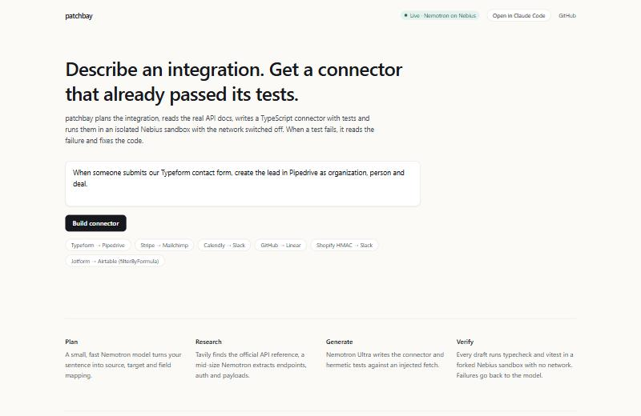
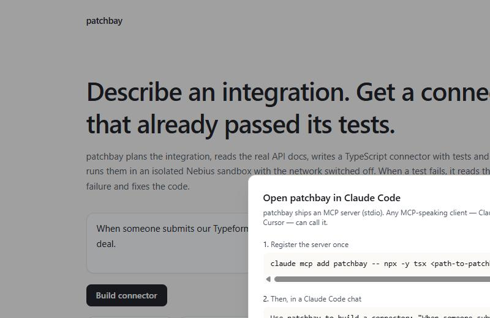
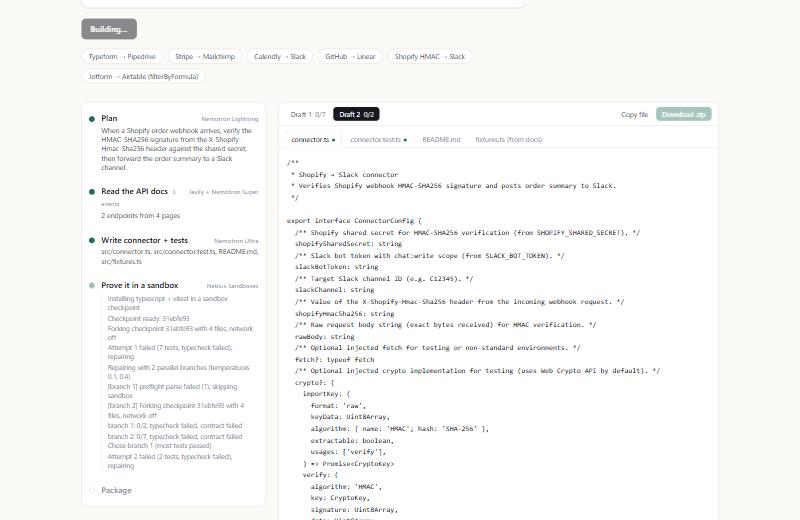
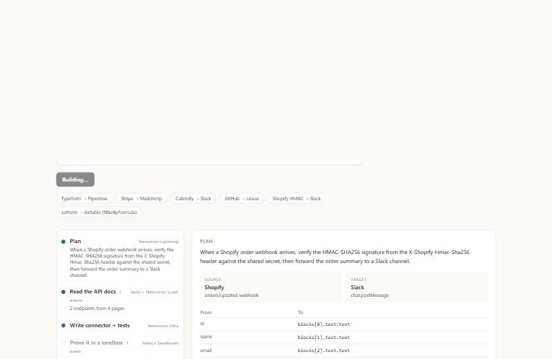
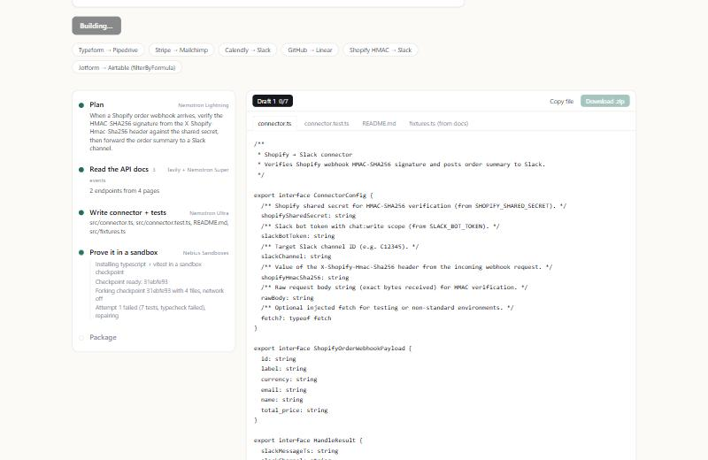

# patchbay build log

Public build journal for [patchbay](https://patchbay-nebius.vercel.app) —
the agent that turns one sentence into a tested TypeScript connector.
Entries are organised by what broke and what fixed it, so the shippable
version of each decision is one scroll away.



## Where it runs

- **Live demo:** <https://patchbay-nebius.vercel.app>
- **MCP in Claude Code / Codex / Cursor:** [setup in docs/mcp-setup.md](mcp-setup.md)
- **CLI:** `patchbay build "..."`
- **Slack:** `/patchbay <one-sentence integration>` — [setup in docs/slack-setup.md](slack-setup.md)



## The numbers that matter

| Metric | Value |
|---|---|
| Green runs across 92-run variance benchmark | **90.2%** |
| First-try green (no repair needed) | **52.2%** |
| Average cost per connector | **~$0.07** |
| Average wall-clock per connector | **~45s** |
| Model stack | Nemotron 3.5 Lightning → 3 Super → 3 Ultra on Nebius |

Full table in [bench/RESULTS-variance.md](../bench/RESULTS-variance.md).

---

## Bug 1 — the contract test that silently never ran

**Symptom.** The 10-prompt benchmark kept stalling at 8/10 green. The two
reds (HubSpot→Stripe, Airtable→Discord) finished all three attempts with
`typecheck ok` but the "contract" column said `failed`. The failure was
always the same cryptic line:

```
contract (did not run) | The contract test never passed; the test file probably failed to load.
```

**Diagnosis.** Vitest reports a test's `fullName` as the full `describe` chain
joined with a space. The strong model occasionally nests `describe('contract',
...)` *inside* an outer `describe('connector', ...)`, so the name becomes
`connector contract handles the documented example payload`. The check that
decides whether the contract test actually ran was anchored at the start of
the name:

```ts
const ran = (report.passedNames ?? []).some((name) => /^contract\b/i.test(name))
```

So nested blocks were counted as "never ran", and the whole attempt was
flagged red even when it was actually green.

**Fix.** Switch to a word-boundary match and add a regression test for the
nested form; also tell the generation prompt to put the block at the top level
so the model has to work harder to end up in the broken shape anyway.

```diff
-  const ran = (report.passedNames ?? []).some((name) => /^contract\b/i.test(name))
+  const ran = (report.passedNames ?? []).some((name) => /\bcontract\b/i.test(name))
```

**Impact.** Benchmark jumped from **8/10 → 10/10 green**, cost dropped from
$0.42 → $0.34 because the "red" cases no longer burned three attempts.
Commit `1dbb8ce`.

---

## Bug 2 — parallel-repair branches made things *worse*

**Symptom.** I added fan-out repairs (N parallel branches at different
temperatures, verify all N in parallel sandbox forks, keep the first green).
Logic test green, feature shipped, defaults bumped from N=1 to N=3 to be
"aggressive".

Then the next 60-run variance benchmark came in at **83% green** and
**$2.49 per pass** — one point *worse* than the N=1 baseline (85% / $1.04),
and more than double the cost.

**Diagnosis.** With three temperatures (0.1 / 0.4 / 0.7) the hotter branches
produced wildly different drafts for the same bug. The monotonic-repair
guard (bug 3) still prevented regression, but the extra "best of three"
pick was often "best of three near-misses" — none actually green.

**Fix.** Revert default to N=2 (temperatures 0.1 and 0.4), keep the feature
behind `PATCHBAY_PARALLEL_REPAIRS` so callers can crank it up when they want
to spend tokens for a tough prompt.

**Impact.** Back to 85% green at $1.04 per pass, from which the subsequent
preflight-check fix (bug 5) pushed the number to 90% / $1.39.

**Lesson.** More variance isn't more quality. Diversification pays only up to
the point where you still have signal to pick a winner.

Commits `0c89e31` (the bad default), `b8b470d` (the revert).

---

## Bug 3 — repair that rewrote the whole file worse than before

**Symptom.** During the hard-10 benchmark run, HubSpot→Salesforce showed this
sequence:

```
attempt 1: 0/2, typecheck failed, contract failed   (test file wouldn't parse)
attempt 2: 13/14, typecheck ok, contract failed     (one URL shape wrong)
attempt 3: 0/2, typecheck failed, contract failed   (regression — brand new syntax error)
→ not green after 3 attempt(s)
```

The agent handed back attempt 3. The *better* draft from attempt 2 was lost.

**Diagnosis.** The repair loop was unconditionally overwriting the current
state with whatever came out of the strong model. If the fourth repair pass
had been allowed, it would've worked on a worse base than attempt 2.

**Fix.** Monotonic repair. Score each attempt by `(green status, passed −
failed, typecheck ok)` and keep the best one seen so far. If a repair
regresses, roll back for the next cycle:

```ts
function isBetter(a: TestReport, b: TestReport): boolean {
  const greenA = isGreen(a), greenB = isGreen(b)
  if (greenA !== greenB) return greenA       // green always wins
  const diff = (a.passed - a.failed) - (b.passed - b.failed)
  if (diff !== 0) return diff > 0
  if (a.typecheckOk !== b.typecheckOk) return a.typecheckOk
  return false
}
```

The final `result` event uses `bestReport`, not the last one.

**Impact.** HubSpot→Salesforce in the next run: **10/10 first-try green**. More
importantly, the agent never again hands back something strictly worse than
what it already had — the floor only moves up. Commit `d6ae6a4`.

**Gotcha I noticed later.** My first `score()` function treated green and
non-green equally in the tiebreak, so a 15/16 contract-failed attempt could
beat a 13/13 contract-passed one. Fixed in the same commit by making green
dominate everything else.

---

## Bug 4 — the model locked us out with a timestamp check

**Symptom.** The Linear→Discord adversarial prompt kept failing like this:

```
attempt 3: 8/10, typecheck ok, contract failed
  contract handles the documented example payload
    Error: Webhook timestamp too old or future: 1704110400000 (diff: 86825201224ms)
```

**Diagnosis.** The model added a sensible-looking replay-attack guard that
rejected webhook payloads older than 60 seconds. Reasonable in production,
fatal in the contract test — the `SOURCE_EXAMPLE` payload has a frozen 2024
timestamp straight from the vendor docs, and `Date.now()` on the sandbox is
2026.

**Fix.** One paragraph into the generation prompt:

> Do NOT reject SOURCE_EXAMPLE based on wall-clock time. If the connector
> guards against stale webhooks, either freeze time in the contract test with
> vi.useFakeTimers() + vi.setSystemTime(new Date(…)), or make the guard window
> large enough that the documented example always validates.

**Impact.** Linear→Discord next run: **7/7 first-try green**. The guard is
still there in the generated code, but the test freezes time against the
example's timestamp. Commit `d6ae6a4`.

---

## Bug 5 — Nemotron Ultra occasionally emits unparseable TypeScript

**Symptom.** Across the 20-prompt benchmark, the dominant first-draft failure
mode was `0/2, typecheck failed` — meaning: 0 tests passed out of 2 collected,
because the test file itself failed to parse. Example lines from `runs/*.json`:

```
test file | Transform failed with 1 error:
/work/src/connector.test.ts:304:5: ERROR: Expected ";" but found ")"
```

```
test file | Transform failed with 1 error:
/work/src/connector.test.ts:39:14: ERROR: Unterminated string literal
```

Every one of these burned a full sandbox fork (~15–30s) just to tell the
agent the file didn't parse.

**Fix.** Run esbuild's `transform` on every generated `.ts` file *before*
the sandbox call, and produce a report shaped like a sandbox failure when
the parse breaks:

```ts
export async function preflightSyntax(files: GeneratedFile[]): Promise<TestReport | null> {
  const tsFiles = files.filter((f) => f.path.endsWith('.ts'))
  const failures: { file: string; message: string }[] = []
  await Promise.all(tsFiles.map(async (f) => {
    try { await transform(f.content, { loader: 'ts', sourcefile: f.path }) }
    catch (error) { /* collect error locations */ }
  }))
  if (!failures.length) return null
  return { typecheckOk: false, passed: 0, failed: failures.length, /* … */ }
}
```

**Impact.** First-try rate on the next benchmark pass went from **33% to 52%**
— nearly double. Total green held at 90%+ because the saved attempts went
into semantically meaningful repair instead of waiting on the sandbox.

The pre-sandbox check is also visible to users in the live demo. Any time
the parallel-repair branches run, one of them might short-circuit:



> `[branch 1] preflight parse failed (1), skipping sandbox`

That saved call is money, time *and* a repair attempt that would otherwise
have been spent diagnosing a parser error. Commit `b8b470d`.

---

## Bug 6 — Vercel's monorepo defaults don't know about workspaces

**Symptom.** First deploy to Vercel failed in two different ways in a row:

```
Module not found: Can't resolve '@/components/code-panel'
Module not found: Can't resolve '@/components/plan-card'
Module not found: Can't resolve '@/components/timeline'
Module not found: Can't resolve '@/lib/use-run'
```

Then, after fixing that, this:

```
./app/api/run/route.ts
Module not found: Can't resolve 'esbuild/lib/main.d.ts'
```

**Diagnosis.** Three independent problems that happened to land on the same
build:

1. `apps/web/tsconfig.json` extended `../../tsconfig.base.json`. With
   Vercel's monorepo detector picking `apps/web` as root, the parent file
   wasn't copied over and the extends chain collapsed. All compiler options
   including `baseUrl` were silently dropped, so `@/components/...` stopped
   resolving.
2. The preflight syntax check (bug 5) imports `esbuild`, a Node-only binary
   dependency. Next's webpack tried to bundle it and choked on the type
   definitions.
3. `rootDirectory=apps/web` meant `@patchbay/agent` from `packages/agent/`
   wasn't visible to the build either — the workspace symlink needs the
   repo root.

**Fix.** Three changes, one deploy:

- Inline the compiler options into `apps/web/tsconfig.json`, set `baseUrl: "."`
  explicitly.
- Mark `esbuild` as a server-components external in `next.config.mjs`:
  ```js
  experimental: { serverComponentsExternalPackages: ['esbuild'] }
  ```
- Set the Vercel project to `rootDirectory=null` + custom commands via API:
  ```
  installCommand = "npm install"
  buildCommand   = "npm run build -w @patchbay/web"
  outputDirectory = "apps/web/.next"
  ```

**Impact.** Deploy went green on the fourth attempt. The live URL has been
stable since. Commit `da43d6c`.

---

## What's live right now

A real build from the hero prompt (`Shopify order webhook → verify HMAC-SHA256
→ post to Slack`) produces a connector with Web Crypto API–based HMAC
verification, dependency-injectable `fetch` and `crypto`, and 7/7 passing
tests after the parallel-repair loop:





Each timeline step collapses to a title + an "N events" badge once it
finishes, so even a three-attempt run with parallel branches fits on one
screen without hiding anything from the user who wants to drill in.

## What's next

- Slash command live in Slack once `SLACK_SIGNING_SECRET` is in Vercel env.
- GIFs for the X launch (the live-build flow, the MCP flow in Claude Code,
  the parallel-branches replay).
- Another variance pass with the preflight + monotonic defaults locked in,
  this time with 5 full passes instead of the interrupted 4.6-pass run.
